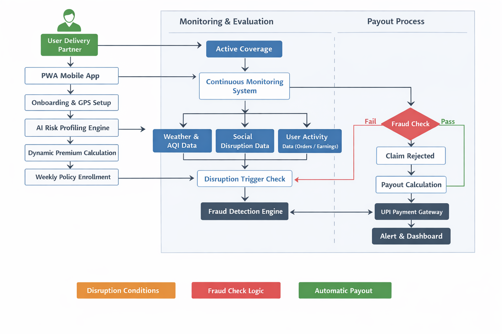
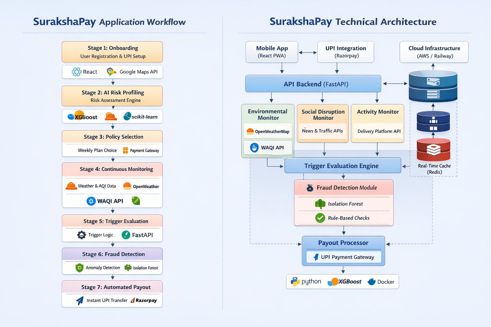

# 🚀 SurakshaPay — AI-Powered Parametric Income Protection for Gig Workers


**SurakshaPay** is a gig-worker income-protection demo: **FastAPI** backend, **React (Vite)** frontend, **SQLAlchemy** DB, **Celery + Redis** for scheduled jobs, external **weather / AQI / RSS**, **XGBoost** for premium quoting, and a **parametric trigger pipeline** (dual-gate + fraud + Razorpay-style payout).

---
## Pitch Deck

[View Pitch Deck](https://drive.google.com/file/d/1cTJfJNUIKaw-GRLEmPATifdiYvjq94Os/view?usp=sharing)
---
> ⚠️ **STRIPE IN TEST MODE ONLY**  
> This demo uses **Stripe in TEST MODE only**. Real card payments will not work.  
>  
> **For testing, use card no as:**  
> **4242 4242 4242 4242**  
> - Any future expiry date  
> - Any 3-digit CVC  
> - Any ZIP/postal code
---
## How to run (local)

### Backend
 .env file from 🔐 [.env File (Download from Google Drive)](https://drive.google.com/file/d/1XGe_95dv_Ms3fyvjDmd4fw4L5hJYMPxg/view?usp=sharing)

```bash
cd backend
python -m venv .venv
.venv\Scripts\activate   # Windows
pip install -r requirements.txt
copy .env file from the drive link above to /backend/.env
uvicorn app.main:app --reload --host 0.0.0.0 --port 8000
```
### Frontend

```bash
cd frontend
npm install
npm run dev
```

### Docker Compose

```bash
docker compose up --build
```

### Celery (optional; matches production story)

- Redis running locally (`REDIS_URL=redis://localhost:6379/0`).
- Worker: `celery -A app.worker:celery_app worker --loglevel=info`
- Beat: `celery -A app.worker:celery_app beat --loglevel=info`
Ensure the UI points at your API (see `frontend/src/lib/api.ts` for base URL / env).


Compose uses a **shared SQLite file** on a volume so **API + Celery** share one database (`DATABASE_URL=sqlite:////app/data/surakshapay.db`).

---
## Repository layout

| Area | Path | Role |
|------|------|------|
| Backend API | `backend/app/main.py` | FastAPI app, routers, CORS, `IntegrationError` → 503 |
| API routes | `backend/app/api/` | `auth`, `users`, `policies`, `claims`, `monitoring`, `payments` |
| Domain logic | `backend/app/services/` | Triggers, weather, cache, fraud, baseline, payouts, features, premium ML, RSS |
| ORM models | `backend/app/models/` | User, Policy, Claim, events, earnings, environment snapshot, Razorpay rows |
| Schemas | `backend/app/schemas/` | Pydantic request/response shapes |
| Auth deps | `backend/app/deps.py` | JWT `get_current_user` |
| Config | `backend/app/config.py` | Settings from env (`backend/.env`) |
| DB | `backend/app/database.py` | Engine + `SessionLocal`; **SQLite** or **Postgres** via `DATABASE_URL` |
| Celery | `backend/app/worker.py`, `backend/app/tasks.py` | Beat schedule + tasks |
| ML assets | `backend/app/ml/` | `train_premium_model.py`, `premium_xgb.pkl` |
| Zone registry | `backend/app/data/work_zones.py` | Work zones metadata |
| Frontend | `frontend/src/` | Vite + React + Tailwind |
| Compose | `docker-compose.yml` | `redis`, `backend`, `celery-worker`, `celery-beat`, `frontend` |

---

## Environment variables (backend)


| Variable | Purpose |
|----------|---------|
| `SECRET_KEY` | JWT signing |
| `DATABASE_URL` | `sqlite:///...` (default dev) or Postgres URL in production |
| `REDIS_URL` | Celery broker + result backend |
| `OPENWEATHER_API_KEY` / `WAQI_API_TOKEN` | Live weather + AQI |
| `GOVERNMENT_RSS_URL` | RSS for social/disruption-style flags |
| `RAZORPAY_*` | Test orders / payouts; optional if `RAZORPAY_OPTIONAL=true` |
| `ALLOW_MOCKS` | Dev mode without real integrations |
| `DEMO_WEATHER_EDGE_CASE` | Enables demo weather mismatch injection for `POST /monitoring/evaluate` when `demo_weather_integrity_mismatch=true` |
| `CORS_ORIGINS` | Allowed browser origins |
| `ENVIRONMENT_CACHE_TTL_SECONDS` | DB snapshot TTL for env bundle (optional) |

---

## API surface (routers)

Mounted in `backend/app/main.py`:

- **`/auth`** — register / login / JWT
- **`/users`** — profile, zone, GPS attestation, daily earnings, etc.
- **`/policies`** — `POST /quote`, `POST /subscribe`, `GET /active`
- **`/claims`** — list / detail claims
- **`/monitoring`** — `GET /live` (cached env + flags), `POST /evaluate` (full pipeline for current user)
- **`/payments`** — Razorpay checkout / webhook flows (see `api/payments.py`)
- **`/health`**, **`/health/integrations`** — liveness + configured integrations (no secrets exposed)

---

## Core runtime flows

### 1) Live monitors + dashboard

1. Client calls **`GET /monitoring/live`** (optional `?refresh=true`).
2. **`environment_cache.get_or_refresh_env_rss`** loads or refreshes **OpenWeather + WAQI + RSS**, stores rows in **`EnvironmentSnapshot`**, returns env + RSS + freshness metadata.
3. **`triggers.live_payload_from_env_rss`** builds boolean **flags** + **details** for the UI. The **AI Shift Coach** on the dashboard computes a client-side score from this payload.

### 2) Parametric evaluation (single user)

1. Client calls **`POST /monitoring/evaluate`** (body may include **`force_mock_disruption`** for demos).
2. **`triggers.run_pipeline_for_user`**:
   - Evaluates **external triggers** (weather/AQI/RSS + mock path).
   - Computes **baseline** and **simulated today earning**, **income drop %**.
   - **Gate 1:** external disruption active. **Gate 2:** drop above threshold (e.g. 40%).
   - If both pass and there is an **active policy**, runs **fraud** (`fraud.evaluate_claim`), creates **`DisruptionEvent`** + **`Claim`**, may call **`payouts.initiate_payout`** (Razorpay order or simulated).

### 2a) Weather fraud edge demo (standalone gate)

1. Client calls **`POST /monitoring/evaluate`** with:
   - `force_mock_disruption=false`
   - `demo_weather_integrity_mismatch=true`
2. Backend enables this path only when `DEMO_WEATHER_EDGE_CASE=true` or `ALLOW_MOCKS=true`.
3. `triggers._apply_demo_weather_integrity_mismatch` injects a deterministic contradiction:
   - `rain_trigger=true` while raw rain metrics stay low (`rain_mm_hour`, `forecast_rain_24h_mm`).
4. Fraud behavior:
   - Normal live and guaranteed-demo flows keep standard blended fraud scoring.
   - When weather-edge injection is applied, `evaluate_claim(..., strict_weather_edge_demo=True)` activates a **standalone weather gate**:
     - reject on weather flag-vs-metric mismatch, or
     - reject when weather-history risk crosses threshold.
   - This demo rejection is intentionally **not blended** with GPS/IsolationForest score.
5. `force_mock_disruption=true` (Guaranteed demo) remains unchanged and still skips weather-integrity checks.

### 3) Scheduled jobs (Celery)

From **`worker.py`** / **`tasks.py`**:

- **Every 15 minutes:** `evaluate_all_triggers_task` → **`run_pipeline_all_users`** (same pipeline per user).
- **Every 5 minutes:** `refresh_environment_snapshots_task` → prefetch env/RSS per user into the DB (**keeps `/live` and pricing inputs warm**).

**Redis** in this codebase is used as Celery’s **broker + result backend** only (not a separate weather cache; snapshots live in the SQL DB).

### 4) Dynamic premium

- **`policies` quote / subscribe** uses **`premium_xgb.quote_plan`**, which builds features via **`services/features.py`** and loads **`app/ml/premium_xgb.pkl`** when present.

### 5) Fraud

- **`services/fraud.py`** — isolation-forest-style signals plus MSTS / geo / attestation checks. Outcome affects **claim status** and whether payout runs.

### 6) Admin / insurer dashboard

- Frontend route: **`/insurer`** (`frontend/src/pages/InsurerDashboardPage.tsx`)
- Primary data source: **`GET /analytics/admin/summary`**
- Main blocks shown in UI:
  - **Portfolio:** workers, active policies, premium pool, paid payouts, claims by status, loss-ratio proxies.
  - **Environment nowcast (24h):** worker-weighted weather rollups across top zones.
  - **Predictive week-ahead disruption:** weather pressure + RSS overlay.
  - **Zone Pressure Matrix:** zone risk tier, suggested premium delta %, illustrative expected new claim events.
  - **Prediction center:** expected payout load, loss-cost-to-premium ratio, illustrative capital buffer, stress watchlist dates.
- Auth note (current code): `_require_admin_token(...)` is bypassed for demo/testing, so the endpoint does not strictly enforce the admin token right now.

---

## Frontend (high level)

| File / area | Role |
|-------------|------|
| `App.tsx` | Routes / shell |
| `lib/api.ts` | `fetch` + auth header + error handling |
| `lib/AuthContext.tsx` | JWT session |
| `pages/LoginPage.tsx` / `RegisterPage.tsx` | Auth UI |
| `pages/DashboardPage.tsx` | Policy, live monitors, evaluate, claims list, AI Shift Coach |
| `data/zones.ts` | Zone list for UX |
| `lib/razorpayCheckout.ts` | Checkout helper when used |

---

## Database

- **SQLAlchemy** models under `backend/app/models/`; tables created in **`init_db()`** on app startup.
- **Docker Compose:** SQLite on a shared volume (required so Celery and API share state).
- **Production:** set **`DATABASE_URL`** to Postgres (or another SQLAlchemy-supported URL).

---


| Goal | Start here |
|------|------------|
| Trigger thresholds / gates | `backend/app/services/triggers.py`, `weather.py`, `rss_alerts.py` |
| Premium formula / ML | `backend/app/services/premium_xgb.py`, `features.py`, `ml/train_premium_model.py` |
| Caching / freshness | `backend/app/services/environment_cache.py`, `config.py` TTL |
| Fraud rules | `backend/app/services/fraud.py` |
| Payout behavior | `backend/app/services/payouts.py` |
| Celery schedule | `backend/app/worker.py` |
| Dashboard UX / coach | `frontend/src/pages/DashboardPage.tsx` |

---

## Health / debugging

- **`GET /health/integrations`** — OpenWeather, WAQI, Razorpay, RSS, model file, cache TTL, fraud label (no secrets).
- **`503`** with JSON `detail` often means **`IntegrationError`** (missing keys or upstream failure); response may include **`X-Suraksha-Integration`** header.


---

## 📌 1. The Problem We Are Solving

India's gig delivery workforce is the invisible backbone of the urban economy. Millions of delivery partners working with platforms like Zomato, Swiggy, and Zepto depend entirely on daily active hours to earn their livelihood. Unlike salaried employees who receive fixed pay regardless of conditions, a delivery partner's income evaporates the moment they cannot step outside.

External disruptions — heavy rainfall, extreme heat, hazardous air quality, sudden curfews, or local strikes — can reduce a delivery worker's active hours by 50 to 100 percent on any given day. This translates directly to a 20–30% loss in monthly earnings, with no safety net available to them today.

The problem is not just financial — it is structural. Traditional insurance products are built for stable, predictable risk profiles. They require claim filing, documentation, agent visits, and waiting periods. For a delivery partner who earns ₹800 today and nothing tomorrow, this system is completely inaccessible and irrelevant.

**SurakshaPay exists to fix this.**

---

## 💡 2. Our Solution

SurakshaPay is a **mobile-first, AI-powered parametric insurance platform** built exclusively for platform-based delivery workers.

The platform protects workers against **loss of income** caused by external, measurable disruptions. It does not cover health issues, vehicle damage, accidents, or life events — strictly income loss only, as per the challenge mandate.

The core insight behind SurakshaPay is simple: if the cause of income loss is measurable and objective (rainfall above a threshold, AQI above a limit, a confirmed curfew), then the payout does not need a claim. It can be triggered automatically.

This is the parametric model — and we have built an entire AI-driven system around it.

When a disruption hits, SurakshaPay:
1. Detects the external event in real-time via APIs
2. Validates that the worker is active and located in the affected zone
3. Measures the actual income drop against the worker's personal baseline
4. Runs fraud detection checks
5. Triggers an instant UPI payout — all within 5 minutes, with zero action required from the worker

---

## 🎯 3. Target Persona

**Sub-Category: Food Delivery Partners (Zomato / Swiggy)**

We chose food delivery partners because:

- They work entirely outdoors, making them maximally exposed to environmental conditions
- Their income is directly correlated with order volume, which drops sharply during disruptions
- They operate on short financial cycles — daily and weekly — making annual or monthly insurance impractical
- Chennai, Bengaluru, Mumbai and other major metros experience frequent weather events that directly impact delivery operations
- This segment represents over 3 million active delivery partners in India, making the impact potential enormous

---

## 👤 4. Persona Scenario — Ravi's Story

Meet **Ravi**, a Swiggy delivery partner based in Chennai's T. Nagar area.

Ravi works six days a week, averaging 8 active hours per day. On a good day he earns around ₹800, primarily during lunch (12–3 PM) and dinner (7–10 PM) peak windows. He has a consistent work pattern, rarely misses shifts, and his earnings over the past month have been stable.

**The Disruption:**

On a Tuesday afternoon, the Tamil Nadu Meteorological Department records 68mm of rainfall in the T. Nagar zone between 2 PM and 6 PM. Roads flood. Customers cancel orders. Swiggy's own surge algorithm suppresses delivery assignments in the zone.

Ravi manages to work only 1.5 hours before conditions become unsafe. His earnings for the day: ₹190, compared to his 7-day average of ₹810.

**What SurakshaPay Does:**

- OpenWeatherMap API flags rainfall > 50mm in Ravi's GPS zone ✅
- System checks Ravi's delivery activity — down 77% from his hourly baseline ✅
- GPS confirms Ravi is located within the disruption boundary ✅
- Fraud engine verifies no anomalous behavior ✅
- Payout calculated: `min(income_loss × coverage_ratio, plan_cap)` = ₹480
- UPI transfer initiated to Ravi's linked account
- Ravi receives a push notification: *"We've got you covered. ₹480 has been sent to your UPI."*

**Time elapsed: 4 minutes 12 seconds. Zero action required from Ravi.**

---

## 🔄 5. End-to-End Application Workflow

### Stage 1: Onboarding

The worker downloads the SurakshaPay app and registers using mobile OTP. During onboarding, they:
- Select their delivery platform (Zomato / Swiggy)
- Allow GPS location tracking (required for zone-based disruption matching)
- Link their UPI ID for instant payouts
- Complete a brief work profile (average hours per day, preferred zones)

The onboarding is designed to take under 3 minutes. No documents, no agent, no waiting.

### Stage 2: AI Risk Profiling

Once onboarded, the system builds an initial **Risk Profile** for the worker. This is not a static score — it is a living model that updates weekly.

The risk profile takes into account:
- The worker's primary operating zone (flood-prone, heat-exposed, pollution-heavy)
- Historical weather patterns for that zone (last 12 months of data)
- The worker's own income variability (how much their earnings fluctuate week to week)
- Their platform activity consistency (regular vs. irregular worker)

Based on this profile, the system assigns a **Risk Score** of Low, Medium, or High, which directly determines the recommended insurance plan and dynamic premium.

### Stage 3: Weekly Policy Selection

The worker selects a weekly plan. Plans are presented in a simple card format with a clear recommended tag based on their risk profile. Premiums are deducted weekly from a prepaid wallet or UPI auto-debit.

### Stage 4: Continuous Monitoring

Throughout the week, the system runs three parallel monitoring threads:

**Thread 1 — Environmental Monitor:** Polls OpenWeatherMap and WAQI APIs every 15 minutes for rainfall, temperature, and AQI readings across all active worker zones.

**Thread 2 — Social Disruption Monitor:** Checks for curfew alerts, traffic disruptions, and zone closures via traffic APIs and news event signals.

**Thread 3 — Activity Monitor:** Tracks each worker's delivery activity (order count, active hours) in real-time, compared against their personal hourly baseline.

### Stage 5: Trigger Evaluation

When a potential disruption is detected, the system runs a **Trigger Evaluation Pipeline**:

```
IF (external_disruption_confirmed = TRUE)
AND (worker_in_affected_zone = TRUE)
AND (income_drop_percentage > threshold)
AND (fraud_score < risk_limit)
THEN → initiate_payout()
```

This logical gate ensures that payouts only happen when all conditions are genuinely met.

### Stage 6: Fraud Detection

Before any payout is approved, the system runs the claim through four fraud detection checks (detailed in Section 11).

### Stage 7: Automated Payout

If the claim passes all checks, the payout is calculated and transferred via UPI. The worker receives a notification with a breakdown of the payout amount and reason.

---

## 💰 6. Weekly Pricing Model — How It Works

SurakshaPay operates on a **weekly subscription model**. This is a deliberate design choice rooted in how gig workers actually manage money.

A delivery partner does not think in annual or monthly cycles. They think week to week. They get paid week to week. So their insurance must work the same way.

Every Monday, the system checks whether the worker's weekly plan is active. If the premium has been paid, coverage is live for the next 7 days. If a disruption occurs mid-week, the system calculates payout based on the actual loss incurred during that coverage window.

### The Three Plans

| Plan | Weekly Premium | Max Weekly Coverage | Max Per-Event Payout | Target Worker |
|------|---------------|---------------------|----------------------|---------------|
| Basic 🟢 | ₹20 | ₹1,000 | ₹300 | Part-time, low-risk zones |
| Standard 🟡 | ₹35 | ₹1,500 | ₹500 | Regular workers, medium-risk |
| Pro 🔴 | ₹50 | ₹2,500 | ₹800 | Full-time, high-risk zones |

### Premium ≠ Guaranteed Payout

A crucial concept for users (and judges) to understand: the premium is the cost of being insured, not a deposit. Ravi pays ₹35 whether or not a disruption occurs. This is standard insurance logic. What he gets in return is the guarantee that if a disruption does occur, he will be compensated up to his plan's coverage limit — without filing a single document.

### The Flexible Boost Add-On

Workers can optionally add ₹10/week to boost their coverage by ₹500 for that week — useful during monsoon season or periods of expected disruption.

### No-Claim Benefit

Workers who go three consecutive weeks without triggering a claim receive a ₹5 discount on the following week's premium. This rewards low-risk behavior and reduces churn.

---

## 🧠 7. AI/ML Integration — Full Technical Detail

AI is embedded at four distinct points in the SurakshaPay pipeline. Here is exactly what each model does, why it is used, and how it works.

### 7.1 — Dynamic Premium Calculation (Risk Scoring Model)

**Purpose:** Calculate a personalized weekly premium for each worker instead of charging everyone the same flat rate.

**Why it matters:** A worker in a flood-prone zone of Chennai carries 3–4x more risk than a worker in a relatively stable zone of Coimbatore. Flat pricing either overcharges low-risk workers (driving them away) or undercharges high-risk workers (making the business unsustainable).

**Model Used:** XGBoost Regressor (Gradient Boosted Trees)

**Input Features:**
- `zone_flood_risk_score` — historical flood frequency for the worker's operating zone (0–1)
- `zone_heat_index` — average peak temperature in operating zone
- `zone_aqi_percentile` — 90th percentile AQI reading over last 3 months
- `worker_income_cv` — coefficient of variation of worker's last 30 days earnings (measures income volatility)
- `worker_consistency_score` — fraction of expected active hours actually worked
- `disruption_frequency_local` — number of disruption events in zone in last 90 days

**Output:** A continuous risk score → mapped to a premium adjustment factor → applied on top of base plan price.

**Training Data:** Synthetic historical data for Phase 1; real delivery and weather data integration planned for Phase 2.

**Example Output:**
```
Base Plan: ₹35 (Standard)
Zone Risk Adjustment: +₹8 (high flood zone)
Consistency Bonus: -₹3 (worker has >90% consistency)
Final Weekly Premium: ₹40
```

---

### 7.2 — Income Baseline & Loss Detection (Time Series Model)

**Purpose:** Determine whether a worker's income has genuinely dropped due to external disruption, and by how much.

**Why it matters:** This is the core of the payout decision. Without an accurate income baseline, we either pay too much (false positives) or too little (failing workers who need help).

**Model Used:** Rolling 7-day Weighted Moving Average (Phase 1) → LSTM for Phase 2

**Phase 1 Implementation:**
```python
# Weighted moving average — recent days weighted more heavily
weights = [0.10, 0.10, 0.12, 0.13, 0.15, 0.18, 0.22]  # day -7 to day -1
baseline = sum(w * e for w, e in zip(weights, last_7_days_earnings))

# Time-of-day normalization
hourly_baseline = baseline * hourly_share[current_hour]

# Drop calculation
drop_pct = (hourly_baseline - actual_earning) / hourly_baseline
```

**Trigger Condition:**
```
drop_pct > 0.40  →  income loss confirmed
```

**Why weighted average, not simple average?** Yesterday's earnings are more predictive than earnings from 7 days ago. The weights reflect this.

**Phase 2 Upgrade Path:** Replace with LSTM (Long Short-Term Memory) network that learns each worker's weekly and seasonal patterns automatically, including peak-hour behavior, festival surges, and weather correlation.

---

### 7.3 — Fraud Detection (Anomaly Detection Model)

**Purpose:** Prevent workers from exploiting the system by faking inactivity, spoofing GPS locations, or submitting duplicate claims.

**Model Used:** Isolation Forest (unsupervised anomaly detection)

**Why Isolation Forest?** It is highly effective at identifying outliers in multidimensional behavioral data without needing labeled fraud examples — which we don't have at launch.

**Features monitored:**
- `gps_consistency` — does the worker's GPS trace match their claimed zone?
- `activity_pattern_delta` — how different is today's activity vs. their historical pattern on similar weather days?
- `device_fingerprint_match` — is the claim coming from the same device used for normal work?
- `event_claim_ratio` — how many claims has this worker filed vs. peers in the same zone during the same event?
- `sudden_inactivity_flag` — did the worker go offline with no prior activity decline leading up to the event?

**Output:** A `fraud_score` between 0 and 1. Claims above 0.75 are flagged for manual review. Claims above 0.90 are auto-rejected with notification.

**Additional Rule-Based Checks (complementary to ML):**
- If disruption is confirmed in Zone A but worker's GPS shows Zone B → reject
- If same disruption event has already generated a payout this week → reject duplicate
- If worker was not logged into the delivery app during the disruption window → reject (not working = not insured for that period)

---

### 7.4 — Smart Work Hour Suggestions (Predictive Model)

**Purpose:** Proactively help workers maximize safe earning hours by predicting upcoming disruptions.

**Model Used:** Logistic Regression on weather + historical order volume features

**How it works:** Each morning, the app sends the worker a "Today's Forecast" notification:
```
🌤️ Today looks good for earnings — high demand expected 12–3 PM
⚠️ Rain likely after 6 PM — consider completing deliveries before then
```

This is the gamification layer — workers who follow safe-hour recommendations earn more and claim less, which lowers the platform's overall loss ratio.

---

## 🌪️ 8. Parametric Trigger System

The parametric trigger system is the engine of SurakshaPay. Unlike traditional insurance, where the worker must prove their loss, in a parametric system the loss is inferred from objective, pre-agreed conditions.

### Environmental Triggers

| Trigger | Threshold | API Source |
|---------|-----------|------------|
| Heavy Rainfall | > 50mm/day OR > 20mm/hr | OpenWeatherMap |
| Extreme Heat | > 40°C sustained for 3+ hours | OpenWeatherMap |
| Severe Air Quality | AQI > 300 | WAQI API |
| Flood Alert | Official flood advisory issued | Government alert API / news signals |

### Social Disruption Triggers

| Trigger | Detection Method |
|---------|-----------------|
| Curfew / Section 144 | Government notification feeds |
| Local Strike | News event classification |
| Zone Closure | Traffic API + local news signals |

### Income Activity Trigger

| Trigger | Threshold |
|---------|-----------|
| Delivery count drop | > 40% below worker's hourly baseline |
| Active hours drop | > 50% below worker's daily baseline |

### The Dual-Gate Rule

A payout is **only triggered when BOTH conditions are met:**

```
Gate 1: External disruption confirmed (environmental OR social trigger)
Gate 2: Worker's personal income drop confirmed (activity trigger)

Both gates must open → Payout approved
Only one gate open → No payout (protects against false claims)
```

This dual-gate design is the most important fraud prevention mechanism in the system. A worker cannot claim during a disruption if they were already inactive before it started. A disruption cannot trigger a payout if the worker's earnings were unaffected.

---

## ⚡ 9. Automated Claim & Payout System

SurakshaPay eliminates the claim process entirely. There is no form to fill, no document to upload, no agent to call.

Here is the complete automated pipeline from disruption to payout:

```
[Step 1]  Weather/Social API detects disruption event in zone XYZ
            ↓
[Step 2]  System identifies all active policyholders in zone XYZ
            ↓
[Step 3]  For each worker → check GPS confirms presence in zone
            ↓
[Step 4]  For each worker → calculate income drop vs. personal baseline
            ↓
[Step 5]  For each eligible worker → run Fraud Detection pipeline
            ↓
[Step 6]  Calculate payout amount:
            payout = min(income_loss × 0.85, plan_max_per_event)
            ↓
[Step 7]  Initiate UPI transfer via Razorpay API
            ↓
[Step 8]  Send push notification to worker
            ↓
[Step 9]  Log event to analytics dashboard
```

**Target SLA: Full pipeline under 5 minutes from disruption detection to UPI transfer initiation.**

---

## 🛡️ 10. Fraud Detection — Full Architecture

Fraud is the existential risk for any parametric insurance system. Because payouts happen automatically, bad actors could attempt to game the system if detection is weak. SurakshaPay uses a layered approach:

### Layer 1 — GPS Zone Validation
Before any claim is processed, the system cross-references the worker's GPS coordinates against the official disruption zone boundary. A worker must be within the affected zone to be eligible. Workers who are 5km away from the event boundary are not considered affected.

### Layer 2 — Activity Authenticity Check
The system checks whether the worker was genuinely logged in and active on their delivery platform before the disruption began. A worker who was already offline or inactive before the event cannot claim income loss caused by the event.

### Layer 3 — Isolation Forest Anomaly Detection
As described in Section 7.3, this model compares the worker's current behavioral pattern against their historical baseline and against peer workers in the same zone. Outliers are flagged.

### Layer 4 — Duplicate Event Guard
Each disruption event is assigned a unique `event_id`. The system maintains a claim ledger per worker per event. Once a payout has been issued for event_id X to worker Y, no second payout can be issued for the same event to the same worker.

### Layer 5 — Device & Identity Binding
Workers are bound to a single device fingerprint and verified phone number. Claims originating from unfamiliar devices are held for additional verification.

---

## 📱 11. Platform Choice — Why Mobile

We chose a **mobile-first web application** (React PWA) over a native mobile app for Phase 1, with a clear path to native app in Phase 2.

**Reasoning:**
- Delivery partners use Android smartphones — a PWA provides instant access without requiring app store approval or download
- Real-time GPS tracking and push notifications are fully supported in modern PWAs
- Faster development cycle for Phase 1 — allows more focus on core logic than platform-specific UI
- UPI deep-link integration works seamlessly in mobile browsers

For Phase 2, we will wrap the PWA in a React Native shell to publish to the Play Store, enabling background location tracking and improved offline reliability.

---

## 🔌 12. System Integrations

| Integration | Purpose | Phase |
|-------------|---------|-------|
| OpenWeatherMap API (free tier) | Real-time weather data | Phase 1 |
| WAQI API (free tier) | Real-time AQI data | Phase 1 |
| Google Maps / Geocoding API | Zone boundary mapping, GPS validation | Phase 1 |
| Razorpay Test Mode | Simulated UPI payouts | Phase 1 |
| Swiggy / Zomato Platform APIs | Delivery activity data | Simulated in Phase 1; real in Phase 2 |
| Government Alert RSS Feeds | Curfew / disaster notifications | Phase 2 |

---

## 📊 13. Analytics Dashboard

### Worker View
The worker dashboard is intentionally simple. It shows:
- Current week's coverage status (Active / Inactive)
- Weekly earnings protected (cumulative)
- Claims received this month with event details
- Premium payment history
- Risk score and plan recommendation

### Admin / Insurer View
The admin dashboard is built for operational insight:
- Real-time risk heatmap across active zones
- Claim frequency vs. premium revenue (loss ratio monitoring)
- Fraud flag queue with reviewer interface
- Predictive disruption forecast for the coming week (using weather ML model)
- Worker retention and churn analytics
- Zone-level payout trend analysis

---

## 💡 14. Key Innovations That Set SurakshaPay Apart

**Micro-Zone Risk Pricing:** Most insurance products price at the city level. We price at the neighborhood/zone level. A worker in Velachery (flood-prone) pays a different premium than a worker in Nungambakkam (relatively safer). This is possible because we combine hyper-local weather data with satellite-based flood risk maps.

**Personalized Income Baseline:** We do not use a fixed income threshold to determine loss. We build a rolling baseline for each individual worker based on their own historical pattern. This means Ravi (who earns ₹800/day) and Kiran (who earns ₹1,200/day) both get fair, calibrated protection.

**Dual-Gate Payout Logic:** Our parametric system requires both an external event AND a personal income drop to be confirmed before triggering a payout. This is more robust than single-condition systems and dramatically reduces false positive payouts.

**Safe Hour Predictions:** We go beyond reactive insurance to proactive income protection by predicting disruptions in advance and helping workers plan safer, more productive schedules.

**Gamified Loyalty Model:** Consistent workers who do not claim are rewarded with lower premiums. This aligns worker incentives with platform sustainability.

---

## 🧱 15. Tech Stack

### Frontend
- **React.js + Tailwind CSS** — Component-based UI with utility-first styling
- **PWA (Progressive Web App)** — Works offline, supports push notifications

### Backend
- **FastAPI (Python)** — High-performance async API framework
- **Celery + Redis** — Background task queue for continuous monitoring jobs
- **JWT Authentication** — Secure mobile session management

### AI/ML
- **Python** with scikit-learn, pandas, numpy
- **XGBoost** — Risk scoring and premium calculation
- **Isolation Forest** — Fraud detection
- **Weighted Moving Average + LSTM (Phase 2)** — Income baseline modeling
- **Logistic Regression** — Safe hour prediction

### Database
- **PostgreSQL** — Primary relational database (users, policies, claims)
- **Redis** — Real-time activity cache and job queue
- **TimescaleDB (Phase 2)** — Time-series extension for activity/earnings history

### Infrastructure
- **Docker + Docker Compose** — Containerized development and deployment
- **AWS EC2 / Railway** — Hosting
- **Cloudflare** — CDN and security

### APIs & Integrations
- OpenWeatherMap API
- WAQI Air Quality API
- Google Maps JavaScript API
- Razorpay Test Mode API
- Simulated delivery platform activity API (mock server)

---

## 🗺️ 16. Development Roadmap

### Phase 1 (March 4–20): Ideation & Foundation ← CURRENT
- Define full system architecture and design
- Write complete README with all technical details
- Build static UI mockups in React
- Set up GitHub repository
- Record 2-minute strategy video

### Phase 2 (March 21 – April 4): Automation & Protection
- Build FastAPI backend with full user registration and policy management
- Implement dynamic premium calculation using XGBoost model
- Integrate OpenWeatherMap and WAQI APIs for live disruption monitoring
- Build parametric trigger evaluation pipeline
- Implement mock UPI payout flow via Razorpay sandbox
- Build core fraud detection logic (GPS validation + rule-based checks)

### Phase 3 (April 5–17): Scale & Optimise
- Integrate Isolation Forest anomaly detection for advanced fraud
- Build full analytics dashboard (worker + admin views)
- Add income baseline model (weighted moving average)
- Implement safe-hour prediction notification system
- Complete end-to-end simulated disruption demo
- Prepare final pitch deck and 5-minute walkthrough video

---

## 🏗️ 17. System Architecture

### 🔷 17.1 Application Workflow Architecture

<p align="center">
  
</p>

<p align="center">
  <em>
  End-to-end application workflow showing onboarding, AI risk profiling, 
  continuous monitoring, disruption detection, fraud validation, and automated payout pipeline.
  </em>
</p>

---

### ⚙️ 17.2 Technical Architecture Diagram

<p align="center">
  
</p>

<p align="center">
  <em>
  System-level architecture illustrating frontend (React PWA), backend (FastAPI), 
  AI/ML modules, monitoring services, database layers, and UPI payment integration.
  </em>
</p>

---

## 🧩 17.3 Architecture Breakdown

### 🟢 User Layer
- Delivery Partner interacts via **React PWA**
- Handles onboarding, GPS tracking, and policy management

### 🔵 API & Backend Layer
- **FastAPI** handles:
  - Authentication (JWT)
  - Policy management
  - Trigger evaluation pipeline
- **Celery + Redis** for asynchronous monitoring jobs

### 🟣 Data & Monitoring Layer
- **Environmental APIs**
  - OpenWeatherMap (rain, temperature)
  - WAQI (air quality)
- **Social Signals**
  - Traffic APIs + news feeds
- **Activity Data**
  - Delivery platform APIs (simulated Phase 1)

### 🟡 AI/ML Layer
- **XGBoost** → Dynamic premium calculation  
- **Weighted Moving Average / LSTM** → Income baseline  
- **Isolation Forest** → Fraud detection  
- **Logistic Regression** → Work hour prediction  

### ⚫ Payout & Notification Layer
- **Razorpay UPI API** for instant transfer  
- Push notifications for user updates  
- Admin dashboard for analytics  

### 🟤 Data Storage Layer
- **PostgreSQL** → Users, policies, claims  
- **Redis** → Real-time cache & queues  
- **TimescaleDB (Phase 2)** → Time-series analytics  

---

## 🚀 17.4 Key Architectural Strengths

✔ Fully automated claim-less insurance system  
✔ Real-time event-driven architecture  
✔ AI-powered personalization at scale  
✔ Fraud-resilient dual-gate validation  
✔ Sub-5 minute payout pipeline  

### 18. 🛡️ SurakshaPay — Adversarial Defense & Anti-Spoofing Strategy

> **"Most systems verify location. SurakshaPay verifies reality."**
---

## 🚨 Threat Model

Modern fraud syndicates exploit parametric insurance systems using **GPS spoofing tools** — faking their presence in disruption zones while remaining inactive in reality. This allows them to trigger mass false payouts, draining liquidity pools.

Traditional systems that rely solely on GPS verification are no longer sufficient.

**SurakshaPay is designed with adversarial resilience at its core.**

---

## 🧠 Real Worker vs. Spoofed Actor

SurakshaPay does not rely on a single signal (GPS). Instead, it uses a **Multi-Signal Trust Score (MSTS)** to evaluate the authenticity of every claim.

| Actor | Behavior |
|---|---|
| ✅ Real Worker | Generates a consistent behavioral, spatial, and device fingerprint |
| ❌ Spoofed Actor | Can fake location — but not the full pattern |

---

## 🔍 Multi-Signal Verification Framework

| Signal Layer | What We Analyze | Real Worker Pattern | Spoofed Pattern |
|---|---|---|---|
| **Movement Trace** | Continuous GPS trajectory | Road-aligned, noisy path | Static / teleport jumps |
| **Speed Profile** | Velocity patterns | Stop-go, realistic speeds | Constant / zero speed |
| **Platform Activity** | Orders, earnings | Active deliveries | No activity |
| **Network Signature** | IP, SIM, carrier | Matches location | VPN / mismatch |
| **Sensor Data** | Accelerometer, gyroscope | Motion + vibration | Flat signals |
| **Zone Entry Pattern** | Entry timing | Gradual | Instant jump |
| **Peer Comparison** | Nearby workers | Similar behavior | Outlier |

---

## 🧮 Trust Score Computation

```
Trust Score = f(
    GPS consistency,
    motion realism,
    activity correlation,
    device integrity,
    network authenticity,
    peer similarity
)
```

---

## 🎯 Decision Thresholds

| Score Range | Action |
|---|---|
| ✅ `> 0.75` | Instant payout |
| ⚠️ `0.40 – 0.75` | Soft verification required |
| ❌ `< 0.40` | Claim blocked / manual review |

---

## 📊 Data Signals Beyond GPS

SurakshaPay upgrades from single-point GPS validation to **multi-dimensional behavioral intelligence**.

### 1. Movement Intelligence (Trajectory Analysis)

- Continuous GPS stream (not snapshots)
- Road-matching with map APIs

**Detects:**
- Teleportation jumps
- Perfect linear movement (synthetic)
- Missing GPS noise (too clean = fake)

---

### 2. Sensor Fusion Layer

With user consent, lightweight signals are collected:

| Sensor | Signal |
|---|---|
| Accelerometer | Detects motion / vibration |
| Gyroscope | Detects turns |
| Motion classifier | Walking / riding / stationary |

- 🟢 **Real rider** → irregular vibration + stop-go pattern
- 🔴 **Spoofer** → flat or synthetic signal

---

### 3. Network & Device Verification

- IP geolocation vs. GPS consistency check
- SIM carrier validation
- Device fingerprint binding
- VPN / proxy detection

---

### 4. Platform Activity Correlation *(Critical Signal)*

- Orders accepted / delivered
- Active vs. idle time
- Earnings consistency

> 🚨 **Strict Rule:** If no platform activity during disruption → **no payout eligibility**
>
> This eliminates the majority of spoofing attempts.

---

### 5. Swarm Intelligence (Fraud Ring Detection)

Detects **coordinated attacks**, not just individuals.

**Detection Signals:**
- Sudden spike in claims in a micro-zone
- Identical movement signatures across users
- Same device / OS clusters
- Similar inactivity patterns

**Approach:**
- Graph-based clustering
- Group anomaly detection

> 👉 If a cluster behaves identically → **entire group flagged**

---

### 6. Environmental Consistency Validation

Cross-checks weather severity against behavioral impact.

**Example:**
```
IF heavy rainfall detected
AND user shows no behavioral impact
→ flag as suspicious
```

---

## ⚖️ UX Balance — Fairness for Honest Workers

Fraud prevention must not harm genuine users. SurakshaPay uses a **3-Tier Claim Handling System**.

### 🟢 Tier 1 — High Confidence
- Trust Score high
- **Instant payout, zero friction**

### 🟡 Tier 2 — Soft Flag (User-Friendly Verification)

Instead of rejection, users see:

> *"We detected unusual activity. Please complete a quick check."*

**Verification options:**
- One-tap selfie (liveness check)
- 30–60 sec background GPS validation
- Activity confirmation

⏱️ Takes < 15 seconds &nbsp;|&nbsp; 📱 No documents required

### 🔴 Tier 3 — High Risk
- Claim paused
- Manual review triggered
- Transparent user notification

### UX Principles

- No sudden rejection without explanation
- Minimal friction for genuine users
- Fast resolution (< few minutes)
- Transparent communication at every step

---

## 🏗️ Architecture — Trust & Verification Engine

### Updated Pipeline

```
Disruption Detection
        ↓
Trigger Evaluation
        ↓
Trust Score Engine        ← NEW
        ↓
Fraud Detection (Isolation Forest)
        ↓
Payout Processor
```

### New Components

| Component | Role |
|---|---|
| Motion Analyzer | Trajectory + speed analysis |
| Sensor Fusion Layer | Accelerometer + gyroscope signals |
| Network Validator | IP, SIM, VPN checks |
| Swarm Detection Module | Coordinated fraud ring detection |
| Trust Score Aggregator | Combines all signals into a single score |

---

## 🚀 Why SurakshaPay is Defensible

| Property | Detail |
|---|---|
| ✔ Multi-signal | Not dependent on GPS alone |
| ✔ Broad coverage | Detects both individual and coordinated fraud |
| ✔ Multi-modal | Behavior + device + network verification |
| ✔ Fast | Maintains < 5 min payout for genuine users |
| ✔ Scalable | Works across cities and worker segments |

## 📌 19. Conclusion

SurakshaPay is not a feature — it is infrastructure. India's gig economy is growing, but the workers powering it remain economically fragile. Every major rainfall, every curfew, every AQI spike is an uninsured financial shock for millions of people.

By combining parametric insurance design, real-time API monitoring, AI-driven risk modeling, and instant UPI payouts, SurakshaPay builds a financial safety net that is fast enough, cheap enough, and smart enough to actually serve this underserved population.The platform is hardened against adversarial GPS spoofing attacks using a multi-signal trust scoring system and swarm-level fraud detection.

We have built the architecture to be scalable beyond food delivery — the same platform can serve e-commerce partners, grocery delivery workers, and any gig segment where income is disrupted by measurable external events.

Phase 1 is our foundation. The architecture is solid, the logic is tested, and the road ahead is clear.

---

*Built for Guidewire DEVTrails 2026 | *
